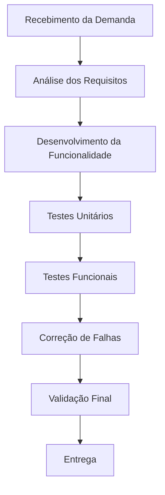

# Aula 14 – Qualidade de Processo

**Disciplina:** Qualidade de Software
**Projeto:** LocalEats

---

## 👤 Integrante

* Vítor Saraiva de Souza

---

# 1. Mapeamento do Processo

## Fluxo Atual do Processo

### Descrição

O processo adotado para o desenvolvimento do projeto LocalEats inicia com o recebimento da demanda e análise dos requisitos. Em seguida, é realizada a implementação da funcionalidade proposta. Após o desenvolvimento, são executados testes unitários e testes funcionais para verificar o correto funcionamento do sistema. Caso sejam encontrados problemas, são realizadas as correções necessárias, seguidas de uma nova validação. Por fim, a funcionalidade é considerada pronta para entrega.

---

# 2. Entradas, Atividades e Saídas

| Etapa                  | Entrada                  | Atividade                          | Saída                                     |
| ---------------------- | ------------------------ | ---------------------------------- | ----------------------------------------- |
| Recebimento da demanda | Solicitação da atividade | Análise dos requisitos             | Requisitos definidos                      |
| Desenvolvimento        | Requisitos definidos     | Implementação da funcionalidade    | Código desenvolvido                       |
| Testes Unitários       | Código implementado      | Execução dos testes unitários      | Defeitos identificados ou código validado |
| Testes Funcionais      | Sistema implementado     | Validação dos fluxos principais    | Funcionalidade validada                   |
| Correção de Falhas     | Problemas encontrados    | Ajustes no código                  | Nova versão corrigida                     |
| Validação Final        | Sistema corrigido        | Revisão e confirmação da qualidade | Sistema aprovado                          |
| Entrega                | Sistema validado         | Disponibilização da versão final   | Funcionalidade entregue                   |

---

# 3. Reflexão sobre o Processo

## 1. O processo utilizado está claramente definido?

Sim. Durante o desenvolvimento da atividade foi seguido um processo organizado, iniciando pela análise dos requisitos, passando pela implementação, execução dos testes, correção de falhas quando necessário e finalizando com a validação antes da entrega.

---

## 2. Todos os integrantes seguem o mesmo fluxo de trabalho?

Como a atividade foi desenvolvida individualmente, todas as etapas seguiram um único fluxo de trabalho, mantendo a mesma organização desde o início até a conclusão do desenvolvimento.

---

## 3. Em quais etapas a qualidade é verificada?

A qualidade é verificada principalmente durante:

* Testes unitários;
* Testes funcionais automatizados;
* Validação dos resultados obtidos;
* Revisão final antes da entrega.

---

## 4. Quais melhorias poderiam tornar o processo mais eficiente?

Algumas melhorias que poderiam ser adotadas são:

* Melhor documentação do processo de desenvolvimento;
* Utilização de listas de verificação (checklists) antes da entrega;
* Ampliação da automação dos testes;
* Revisões periódicas do código para identificar oportunidades de melhoria.

---

## 5. Como a qualidade do processo impacta a qualidade do produto final?

Um processo bem organizado contribui diretamente para a qualidade do software. Quando as etapas são executadas de forma estruturada, é possível reduzir retrabalho, identificar erros com mais rapidez e aumentar a confiabilidade da aplicação. Além disso, um processo consistente facilita futuras manutenções e evoluções do sistema.

---

# ✅ Conclusão

A atividade permitiu compreender que a qualidade de software não depende apenas da implementação do código, mas também da organização do processo utilizado durante o desenvolvimento. A definição clara das etapas, aliada à execução de testes e validações, contribui para reduzir falhas, melhorar a produtividade e entregar um sistema mais confiável.

No contexto do projeto LocalEats, a aplicação de um processo estruturado auxilia na produção de funcionalidades com maior qualidade e facilita a manutenção e evolução do sistema ao longo do tempo.
